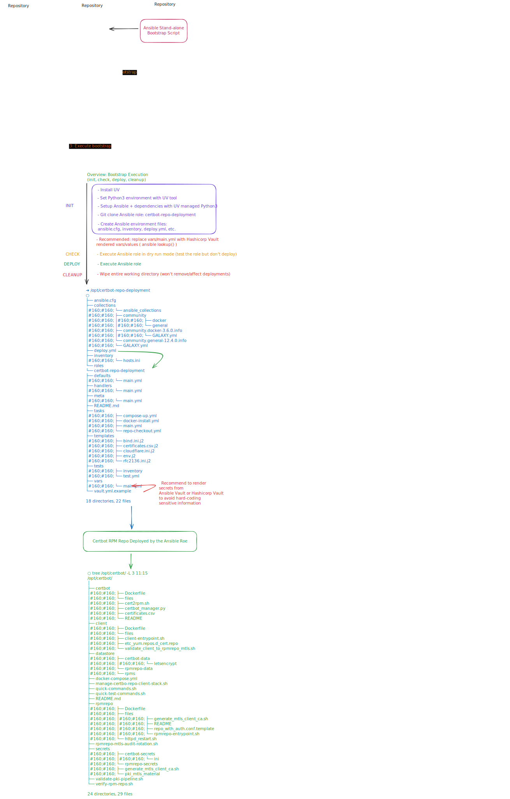

# 🏗️ Certbot Repo Deployment Bootstrapper

### *Enterprise-Grade Automation for PKI & Repository Management*

This project provides a high-reliability bootstrap utility designed to initialize, manage, and execute the **Certbot Repository Deployment** Ansible role.

It provisions a controlled, root-managed Python toolchain using `uv`, enforces privileged execution where required, implements execution locking to prevent race conditions, and maintains structured logging for operational auditability.

---

## 🏗 Architecture Overview



This project follows a layered deployment model to ensure separation of concerns, deterministic execution, and cross-distribution compatibility.

### Design Principles

#### **Layered Responsibility**

- **Bootstrap Layer**  
  Installs a predictable, root-managed toolchain (`uv`, pinned `ansible-core`, Galaxy collections).

- **Ansible Role Layer**  
  Declarative Infrastructure-as-Code responsible for provisioning and configuration.

- **Application Stack Layer**  
  Docker-based Certbot + RPM repository solution deployed by the role.

#### **Deterministic Execution**

- Pinned dependency versions with controlled fallback for cross-distribution compatibility.
- Root-managed runtime tools installed in predictable paths.
- Localized Ansible roles and collections to avoid global state drift.

#### **Cross-Distribution Compatibility**

- Debian-based systems (Python ≥ 3.10) install `ansible-core 2.16.x`.
- RHEL / AlmaLinux systems (Python 3.9 default) automatically fall back to `2.15.x`.
- Numeric UID/GID ownership ensures compatibility with local users, LDAP, and AD environments.

#### **Operational Safety**

- Execution locking prevents concurrent runs.
- Structured logging supports auditability.
- Idempotent initialization allows safe re-execution.

This architecture enables standalone, reproducible deployments without requiring a dedicated Ansible control node.

---

## 🌟 Key Features

- ⚡ **UV Integration** — Uses [Astral's UV](https://github.com/astral-sh/uv) for fast, pinned dependency management.
- 🔒 **Execution Locking** — Prevents concurrent deployments via `/run/lock/certbot-deploy.lock`.
- 📄 **Persistent Logging** — Mirrors output to `/var/log/ansible-deploy/`.
- 📌 **Version Pinning with Fallback** — Installs preferred Ansible versions while maintaining compatibility across distributions.
- 🏗️ **Automated Environment Bootstrap** — Clones repository, provisions virtualenv, installs collections, and generates Ansible configuration.
- 🛡️ **Controlled Ownership Model** — Uses numeric UID/GID ownership to support local, LDAP, and AD-backed users.
- 🧭 **Root-Managed Toolchain** — Installs `uv` in a predictable system path for consistent execution across restricted environments.

---

## 🚀 Quick Start

### 1️⃣ Requirements

- Linux (Ubuntu / Debian / RHEL / AlmaLinux compatible)
- `sudo` access
- `git`, `curl`, and `python3` installed
- Internet access for repository cloning and dependency installation

---

### 2️⃣ Initialization

```bash
chmod +x certbot-repo-deployment-bootstrap.sh
sudo ./certbot-repo-deployment-bootstrap.sh init
```

The `init` command will:

- Clone or update the deployment repository
- Install `uv` to a predictable system path (if missing)
- Create a managed Python virtual environment
- Install pinned dependencies (with distribution-aware fallback)
- Install required Ansible Galaxy collections
- Generate `ansible.cfg`, inventory, and `deploy.yml`

------

### 3️⃣ Deployment

```bash
sudo ./certbot-repo-deployment-bootstrap.sh deploy
```

This runs the generated `deploy.yml` playbook with:

- `--diff`
- `--flush-cache`

------

## 🛠 Command Reference

| Command  | Action                                                       |
| -------- | ------------------------------------------------------------ |
| `init`   | Prepare environment, clone role, install toolchain & dependencies |
| `deploy` | Execute deployment playbook                                  |
| `check`  | Execute playbook in Ansible check mode (no changes applied)  |
| `clean`  | Remove `/opt/certbot-repo-deployment` and local artifacts    |

------

## 📂 Project Structure (Post-Initialization)

```bash
/opt/certbot-repo-deployment/
├── .venv/               # Managed Python virtual environment
├── roles/               # Ansible roles
├── collections/         # Local Galaxy collections
├── inventory/           # Target host definitions
├── ansible.cfg          # Hardened Ansible configuration
└── deploy.yml           # Primary deployment playbook
```

------

## 📜 Logging & Troubleshooting

### Logs

Deployment logs are written to:

```bash
/var/log/ansible-deploy/deploy_YYYYMMDD.log
```

If not executed as root, logs will only display on stdout.

------

### Locking

If a deployment is already running:

```bash
Deployment already in progress (Lock found: /run/lock/certbot-deploy.lock).
```

If a previous execution was interrupted:

```bash
sudo rm /run/lock/certbot-deploy.lock
```

------

## 🌐 Remote Inventory Configuration

By default, the inventory targets `localhost`.

To deploy to remote hosts, edit:

```bash
/opt/certbot-repo-deployment/inventory/hosts.ini
```

Example:

```bash
[certbot_hosts]
repo-server-01 ansible_host=10.0.5.20
repo-server-02 ansible_host=10.0.5.21

[certbot_hosts:vars]
ansible_user=sysadmin
ansible_ssh_private_key_file=~/.ssh/id_rsa
```

You may also modify `deploy.yml` if your role requires additional variables.

------

## 🔄 Updating the Environment

To synchronize repository updates and re-apply pinned dependencies:

```bash
sudo ./certbot-repo-deployment-bootstrap.sh init
```

The script is idempotent and safe to re-run.

------

## 🛡 Security Model

- Must be executed with `sudo`.
- Root privileges are required for:
  - Writing to `/opt`
  - Writing to `/var/log`
  - Creating lock files in `/run/lock`
- Ownership of generated files is assigned via numeric UID/GID to ensure compatibility with:
  - Local system users
  - LDAP / SSSD
  - Active Directory-backed identities

This design ensures predictable execution, minimal permission drift, and compatibility across enterprise environments.

------

## 📝 Operational Notes

Before reporting issues:

1. Review logs in `/var/log/ansible-deploy/`
2. Confirm lock file state
3. Re-run `init` to ensure environment consistency
4. Verify Python version compatibility if forcing a specific Ansible version

---